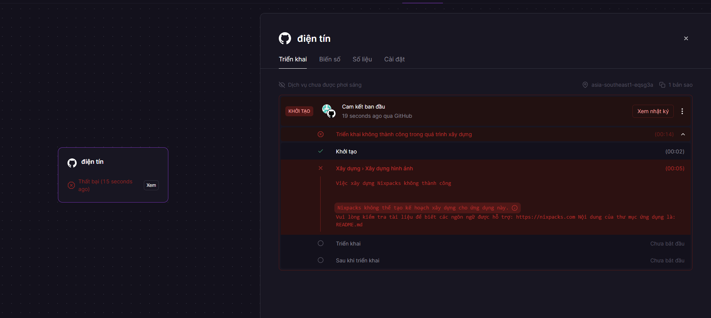
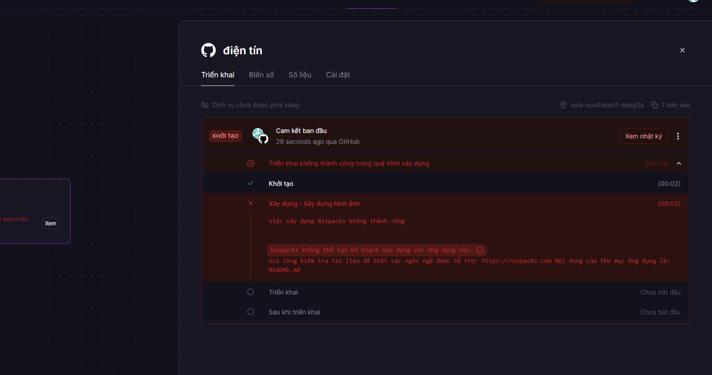

# 🤖 ABCD.BET Customer Service Bot

Bot quản lý khách hàng và chuyển tiếp tin nhắn tự động cho ABCD.BET.

## ✨ Tính năng chính

- 📢 **Gửi tin nhắn hàng loạt** đến tất cả khách hàng
- 🎯 **Gửi tin nhắn theo bộ lọc** (ngày đăng ký, trạng thái)
- ⏰ **Hẹn giờ chuyển tiếp** tin nhắn đến kênh
- 📋 **Template tin nhắn** có sẵn
- 📊 **Thống kê khách hàng** chi tiết
- 🔔 **Hệ thống thông báo** tích hợp
- 🎁 **Quản lý khuyến mãi** ABCD.BET

## 🚀 Cài đặt

### Yêu cầu hệ thống
- Python 3.11+
- Telegram Bot Token
- Google Sheets API (tùy chọn)

### Cài đặt dependencies
```bash
pip install -r requirements.txt
```

### Cấu hình
1. Tạo file `.env` từ `.env.example`
2. Điền thông tin bot token và cấu hình khác
3. Chạy bot:
```bash
python bot.py
```

## 📱 Sử dụng

### Lệnh cơ bản
- `/start` - Khởi động bot
- `/help` - Xem trợ giúp
- `/bulk` - Gửi tin nhắn hàng loạt
- `/scheduled_forward` - Hẹn giờ chuyển tiếp

### Định dạng thời gian hỗ trợ
- **Ngày tháng:** `25/12/2024 14:30`, `2024-12-25 14:30`
- **Số liên tục:** `25092024143000`, `20240925143000`
- **Thời gian đơn giản:** `14:30`, `hôm nay 14:30`
- **Tương đối:** `+30 phút`, `+2 giờ`, `+1 ngày`
- **Tự nhiên:** `sáng 9:00`, `chiều 15:00`, `tối 20:00`

## 🌐 Deploy

### Railway (Khuyến nghị)
```bash
# Cài Railway CLI
npm install -g @railway/cli

# Deploy
railway login
railway init
railway up
```

### Render
1. Kết nối GitHub repository
2. Tạo Web Service
3. Build Command: `pip install -r requirements.txt`
4. Start Command: `python bot.py`

### Heroku
```bash
# Tạo Procfile
echo "worker: python bot.py" > Procfile

# Deploy
git add .
git commit -m "Deploy bot"
git push heroku main
```

## 📁 Cấu trúc project

```
├── bot.py                 # File chính
├── scheduled_forward.py   # Module hẹn giờ chuyển tiếp
├── config/
│   └── settings.py        # Cấu hình
├── requirements.txt       # Dependencies
├── Procfile              # Heroku config
├── railway.json          # Railway config
└── README.md             # Tài liệu
```

## 🔧 Cấu hình

### Biến môi trường
- `BOT_TOKEN` - Telegram Bot Token
- `ADMIN_USER_IDS` - ID admin (cách nhau bởi dấu phẩy)
- `GOOGLE_CREDENTIALS_FILE` - Đường dẫn file Google credentials
- `GOOGLE_SHEET_ID` - ID Google Sheet
- `FORWARD_CHANNELS` - Danh sách kênh chuyển tiếp

## 📞 Hỗ trợ

Nếu gặp vấn đề, vui lòng tạo issue trên GitHub hoặc liên hệ admin.

## 📄 License

MIT License - Xem file LICENSE để biết thêm chi tiết.